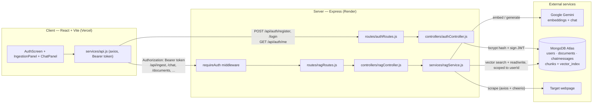

# URL-CHAT

RAG-powered chat over any webpage. Paste a URL, and ask questions that are answered
**strictly from that page's content** — with the exact source passages shown under every answer.

**Stack:** React + Vite + Tailwind · Express (ESM) · LangChain.js · Google Gemini (embeddings + chat) · MongoDB Atlas Vector Search

---

## Table of contents

- [What it does](#what-it-does)
- [Architecture](#architecture)
- [How the RAG pipeline works](#how-the-rag-pipeline-works)
- [Project layout](#project-layout)
- [API reference](#api-reference)
- [Data model](#data-model)
- [Local development](#local-development)
- [Environment variables](#environment-variables)
- [Deployment](#deployment)
- [Design decisions & fallbacks](#design-decisions--fallbacks)

---

## What it does

1. **Ingest** – you give it a URL. The server scrapes the page, strips the noise
   (nav, scripts, footers, SVGs…), splits the readable text into overlapping chunks,
   embeds each chunk with Gemini, and stores the vectors in MongoDB Atlas.
2. **Chat** – you ask a question. The server embeds the question, runs a vector
   similarity search scoped to that URL, feeds the top matching chunks to Gemini as
   context, and returns an answer that is grounded only in those chunks.
3. **Cite** – every assistant answer ships with the chunks it was built from, shown in
   a collapsible "sources" panel so you can verify the answer against the page.
4. **Persist** – indexed pages and full chat history are saved per-URL, so you can
   close the tab and pick a source back up later.

---

## Architecture


```mermaid
flowchart LR
    subgraph Client["Client — React + Vite (Vercel)"]
        UI["AuthScreen + IngestionPanel + ChatPanel"]
        API["services/api.js (axios, Bearer token)"]
        UI --> API
    end

    subgraph Server["Server — Express (Render)"]
        AR["routes/authRoutes.js"]
        AC["controllers/authController.js"]
        RA["requireAuth middleware"]
        R["routes/ragRoutes.js"]
        C["controllers/ragController.js"]
        S["services/ragService.js"]
        AR --> AC
        RA --> R --> C --> S
    end

    subgraph External["External services"]
        G["Google Gemini<br/>embeddings + chat"]
        M[("MongoDB Atlas<br/>users · documents · chatmessages<br/>chunks + vector_index")]
        W["Target webpage"]
    end

    API -- "POST /api/auth/register, /login<br/>GET /api/auth/me" --> AR
    API -- "Authorization: Bearer token<br/>/api/ingest, /chat, /documents, ..." --> RA
    AC -- "bcrypt hash + sign JWT" --> M
    S -- "scrape (axios + cheerio)" --> W
    S -- "embed / generate" --> G
    S -- "vector search + read/write, scoped to userId" --> M
```

### Client

- **React 18 + Vite 6**, styled with **Tailwind CSS 3** (dark theme, single-page app).
- Two-pane layout: a resizable **IngestionPanel** (add URL, source library, ingest
  progress stepper) and a **ChatPanel** (markdown-rendered transcript with per-message
  source accordions). Collapses to a slide-in drawer on mobile.
- `react-markdown` + `remark-gfm` render assistant answers; `lucide-react` for icons.
- All network calls go through [`client/src/services/api.js`](client/src/services/api.js),
  which attaches the logged-in user's JWT as `Authorization: Bearer <token>` to every
  request. In dev, requests hit `/api` and Vite proxies them to `http://localhost:5000`;
  in prod set `VITE_API_URL` to the backend origin.
- The whole app is gated behind [`AuthScreen`](client/src/components/AuthScreen.jsx) —
  a stored token is validated against `GET /api/auth/me` on load; no valid token means
  no document library, no chat, just the login/signup form.

### Server

- **Express** app ([`server/src/index.js`](server/src/index.js)) with `helmet`,
  `compression`, configurable **CORS** (`CLIENT_URL` accepts a comma-separated list),
  a **rate limiter** (30 req/min on `/api`, 20 req/15min on `/api/auth`), request
  logging, a `/health` endpoint, and graceful shutdown on `SIGINT`/`SIGTERM`.
- **Every `/api/*` route requires a logged-in user** except `/api/auth/register` and
  `/api/auth/login`. [`middleware/auth.js`](server/src/middleware/auth.js) verifies the
  JWT and attaches `req.userId`; every document, chunk, and chat message is tagged with
  it, so one user never sees another's data.
- Thin **routes → controller → service** structure. All RAG logic lives in
  [`server/src/services/ragService.js`](server/src/services/ragService.js); the
  controller only validates input and shapes responses.
- Can optionally serve the built client from `client/dist` in production for a
  single-port deployment (`npm start` from the repo root).

### Storage

| Collection      | Written by            | Purpose                                                        |
| --------------- | --------------------- | ------------------------------------------------------------- |
| `users`         | Mongoose `User`       | One record per account: email, bcrypt password hash, createdAt. |
| `documents`     | Mongoose `Document`   | One record per (user, URL): title, chunk count, timestamp.    |
| `chatmessages`  | Mongoose `ChatMessage`| Full per-(user, URL) conversation history, incl. stored source chunks. |
| `chunks`        | LangChain `MongoDBAtlasVectorSearch` | Text chunk + 3072-dim embedding + `{ url, title, userId, chunkIndex }` metadata. Queried through the `vector_index` Atlas Vector Search index, then filtered to the active user and URL. |

If `MONGO_URI` is not set (or Atlas is unreachable at boot), the server runs in
**in-memory mode**: a LangChain `MemoryVectorStore` plus plain `Map`s hold documents,
chunks, and chat history for the lifetime of the process.

---

## How the RAG pipeline works

Both endpoints below require `Authorization: Bearer <token>` — every call is scoped to
the requesting user's own documents and chunks.

### Ingestion — `POST /api/ingest`

`processAndIndexUrl(url, userId)` in [`ragService.js`](server/src/services/ragService.js):

1. **Scrape** (`scrapeAndCleanUrl`) – `axios` fetches the HTML with a browser
   User-Agent (15 s timeout). `cheerio` removes `script, style, nav, footer, header,
   aside, iframe, noscript, svg, form`, then extracts text from `<main>`, else
   `<article>`, else `<body>`. Title comes from `<title>` → `<h1>` → `og:title` → the URL.
   Whitespace is collapsed; pages with < 50 chars of text are rejected.
2. **Chunk** – `RecursiveCharacterTextSplitter` with `chunkSize: 1000`,
   `chunkOverlap: 200`. Each chunk carries `{ url, title, chunkIndex, totalChunks }`.
3. **Embed** – `GoogleGenerativeAIEmbeddings` (`models/gemini-embedding-001`, 3072 dims).
4. **Index** – old chunks for the same URL are deleted first (re-ingest is idempotent),
   then `store.addDocuments(docs)` writes chunk + vector into the `chunks` collection.
5. **Record** – upsert a `Document` metadata row (or an in-memory entry).

The client shows a 4-step progress stepper during this call.

### Query — `POST /api/chat`

`queryRagChain(url, question, userId)`:

1. **Retrieve** – `store.similaritySearch(question, 15)`, then filter results down to
   `metadata.url === url && metadata.userId === userId` and keep the top **4** chunks.
   (Over-fetching then filtering keeps retrieval scoped to one user's copy of one page,
   even though every user's chunks share the same collection and vector index.)
2. **Fallback retrieval** – if vector search errors or returns nothing, a keyword
   overlap scorer (`performTextRelevanceSearch`) ranks the in-memory chunks for that URL.
3. **Assemble context** – chunks are concatenated as `[Source Chunk N]\n…` blocks.
4. **Generate** – `ChatGoogleGenerativeAI` (`models/gemini-3.6-flash`, `temperature: 0.2`)
   with a strict system prompt: answer only from context, and if the context is
   insufficient reply exactly *"I could not find relevant information in the provided URL."*
5. **Respond & persist** – returns `{ answer, sources }` and appends the user question
   and assistant answer (with its source chunks) to chat history.

---

## Project layout

```
URL-CHAT/
├── package.json              # root scripts: install:all, dev, build, start (uses concurrently)
├── client/
│   ├── vite.config.js        # dev server on :5173, proxies /api → :5000
│   └── src/
│       ├── App.jsx           # state: user, documents, activeDocument, messages, ingest steps
│       ├── services/api.js   # axios client — attaches Bearer token, all 8 endpoints
│       └── components/       # AuthScreen, Header, IngestionPanel, ChatPanel,
│                             # StatusStepper, DocumentItem, SourceAccordion
└── server/
    ├── scripts/
    │   ├── setupVectorIndex.js       # one-time: create `chunks` collection + `vector_index`
    │   └── migrateToUserAccounts.js  # one-time: run after upgrading an existing deployment
    │                                 # to user accounts (see "Deployment" below)
    └── src/
        ├── index.js              # Express app, middleware, static hosting, lifecycle
        ├── config/db.js          # Mongo connect w/ SRV-DNS fallback; degrades to in-memory
        ├── middleware/auth.js    # verifies the JWT, attaches req.userId
        ├── routes/
        │   ├── authRoutes.js     # register, login (public) · me (requires auth)
        │   └── ragRoutes.js      # ingest, chat, documents, history (all require auth)
        ├── controllers/
        │   ├── authController.js
        │   └── ragController.js
        ├── services/ragService.js   # scrape · chunk · embed · index · retrieve · generate
        └── models/
            ├── User.js           # email, bcrypt passwordHash, createdAt
            ├── Document.js       # unique per (userId, url)
            └── ChatMessage.js
```

---

## API reference

Base path: `/api`. Every route below except the two auth ones requires
`Authorization: Bearer <token>` (missing/expired/invalid → `401`), and every result is
scoped to that token's user.

| Method & path               | Auth required | Body / query                | Returns |
| ---------------------------- | ------------- | --------------------------- | ------- |
| `POST /api/auth/register`    | no            | `{ email, password }` (password ≥ 8 chars) | `{ token, user: { id, email } }` · `409` if email taken |
| `POST /api/auth/login`       | no            | `{ email, password }`       | `{ token, user: { id, email } }` · `401` on bad credentials |
| `GET /api/auth/me`           | **yes**       | –                            | `{ user: { id, email } }` — used by the client to validate a stored token |
| `POST /api/ingest`           | **yes**       | `{ url }`                   | `{ success, documentId, url, title, chunkCount, createdAt }` |
| `POST /api/chat`             | **yes**       | `{ url, question }`         | `{ answer, sources: [{ pageContent, metadata }] }` |
| `GET /api/chat/history`      | **yes**       | `?url=<url>`                | `{ success, history: ChatMessage[] }` |
| `GET /api/documents`         | **yes**       | –                            | `{ success, documents: Document[] }` (newest first, this user only) |
| `DELETE /api/documents/:id`  | **yes**       | path param `id`              | `{ success, message, deletedId }` — also drops the URL's chunks and chat history. `404` if the document isn't yours. |
| `GET /health`                | no            | –                            | `{ status, environment, timestamp, service }` |

`POST /api/ingest` normalizes bare hosts (`example.com` → `https://example.com`) and
rejects malformed URLs with `400`.

---

## Data model

**User**
| Field          | Type   | Notes                              |
| -------------- | ------ | ----------------------------------- |
| `email`        | String | unique, lowercased, required        |
| `passwordHash` | String | bcrypt, 10 salt rounds — never the raw password |
| `createdAt`    | Date   | defaults to now                     |

**Document**
| Field        | Type     | Notes                        |
| ------------ | -------- | ---------------------------- |
| `userId`     | ObjectId | required; compound-unique with `url` — the same URL can be indexed independently by different users |
| `url`        | String | required                     |
| `title`     | String | scraped page title           |
| `chunkCount` | Number | chunks produced at ingest    |
| `createdAt`  | Date   | defaults to now              |

**ChatMessage**
| Field       | Type                        | Notes                                   |
| ----------- | --------------------------- | --------------------------------------- |
| `userId`    | ObjectId                    | required; indexed together with `url`  |
| `url`       | String                       | which source this message belongs to    |
| `role`      | `'user' \| 'assistant' \| 'system'` | required                        |
| `content`   | String                      | required                                |
| `sources`   | `[{ pageContent, metadata }]` | retrieved chunks (assistant messages) |
| `createdAt` | Date                        | ordering key for history                |

---

## Local development

```bash
npm run install:all          # installs both server/ and client/
# create server/.env  (see "Environment variables")
npm run dev                  # server on :5000, client on :5173, run concurrently
```

Vite proxies `/api` to the local server, so no client env var is needed for local dev.
`MONGO_URI` is optional locally — without it the app runs fully in memory.

Other root scripts:

| Script                         | Effect                                                        |
| ------------------------------ | ------------------------------------------------------------ |
| `npm run build`                | builds the client into `client/dist`                        |
| `npm start`                    | builds the client, then runs the server in production mode serving that build (single port) |
| `npm run start:server-only`    | production server without rebuilding the client            |

---

## Environment variables

### Backend — `server/.env` locally, host dashboard in production

| Variable                 | Required            | Notes |
| ------------------------ | ------------------ | ----- |
| `GOOGLE_API_KEY`         | **yes**            | Server exits on startup without it. |
| `JWT_SECRET`             | **yes**            | Server exits on startup without it. Signs and verifies login tokens — use a long random string, e.g. `node -e "console.log(require('crypto').randomBytes(48).toString('hex'))"`. Changing it invalidates every existing token (forces re-login). |
| `MONGO_URI`              | yes in production  | Atlas connection string. Without it, data is in-memory only. |
| `CLIENT_URL`             | yes in production  | Frontend origin(s) for CORS, e.g. `https://url-chat.vercel.app`. Comma-separate to allow several. |
| `NODE_ENV`               | yes in production  | Set to `production`. |
| `PORT`                   | no                 | Defaults to `5000`. |
| `GOOGLE_CHAT_MODEL`      | no                 | Defaults to `models/gemini-3.6-flash`. |
| `GOOGLE_EMBEDDING_MODEL` | no                 | Defaults to `models/gemini-embedding-001` (3072 dims — must match the Atlas index). |

### Frontend — `client/.env`

| Variable       | Required           | Notes |
| -------------- | ----------------- | ----- |
| `VITE_API_URL` | yes in production | Backend API base, e.g. `https://url-chat-api.onrender.com/api`. Omit locally (Vite proxy handles it). |

---

## Deployment

Backend on **Render**, frontend on **Vercel** (or use the single-port `npm start` on any Node host).

### 1. MongoDB Atlas (one-time)

```bash
node server/scripts/setupVectorIndex.js
```

Creates the `chunks` collection and the `vector_index` Atlas Vector Search index
(3072 dimensions, cosine similarity) that retrieval depends on. Atlas takes a minute
or two to finish building the index before it is queryable.

### 2. Backend (Render)

- Root directory `server/`, build `npm install`, start `npm run start:prod`.
- Set `GOOGLE_API_KEY`, `JWT_SECRET`, `MONGO_URI`, `CLIENT_URL`, `NODE_ENV=production`.

### 3. Frontend (Vercel)

- Root directory `client/`, framework Vite.
- Set `VITE_API_URL` to the Render backend URL with `/api` appended.

### 4. Upgrading an existing deployment to user accounts

If you ran this app before accounts existed, run once against production (after
deploying this code):

```bash
node server/scripts/migrateToUserAccounts.js
```

This drops the old global-unique index on `documents.url` (which otherwise blocks two
different users from ever indexing the same page) and reports any pre-account data —
it deletes nothing automatically. Skip this step on a brand-new deployment.

---

## Design decisions & fallbacks

- **Per-user isolation.** Every document, chunk, and chat message is tagged with the
  owning user's id and filtered by it on every read, write, and delete — including
  inside the vector search's post-filter and the in-memory fallback's keys. A document
  lookup for someone else's id simply returns nothing (`404`), not a permission error.
- **Graceful degradation.** No Mongo? The server logs a warning and runs on an
  in-memory vector store instead of crashing — handy for demos and local dev.
- **Retrieval robustness.** If the embedding API or vector index fails at query time,
  a keyword-overlap search over the cached chunks still produces an answer.
- **Idempotent ingest.** Re-adding a URL deletes its previous chunks before indexing,
  so counts and vectors never drift.
- **Grounded answers.** The system prompt forbids outside knowledge and mandates a
  fixed "not found" response, and the UI surfaces the source chunks so answers are auditable.
- **SRV DNS retry.** `config/db.js` retries the Atlas `mongodb+srv://` lookup against
  public DNS (1.1.1.1 / 8.8.8.8) when the local resolver is misconfigured (common on VPNs).
- **Persistent embeddings.** Vectors live in Atlas, so restarts don't re-scrape or
  re-embed anything; on boot the server just logs how many docs and chunks it found.
